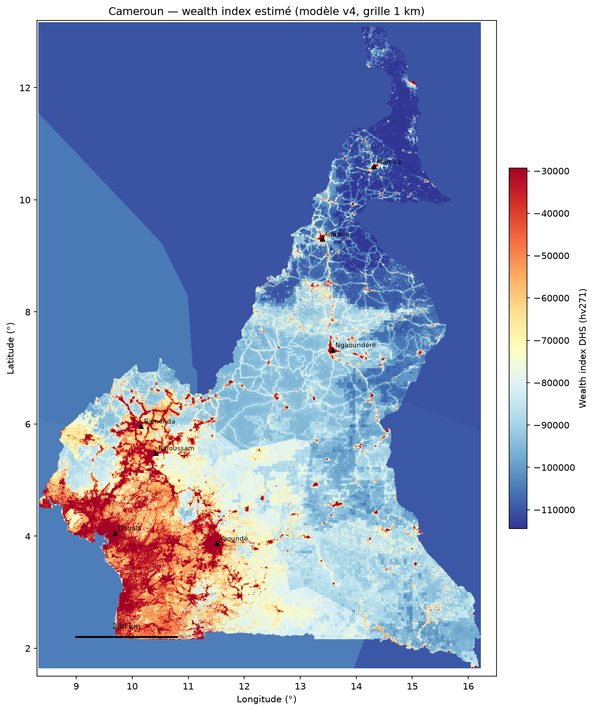
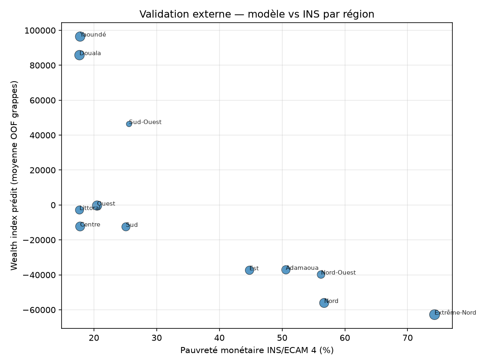

# Cartographie de la pauvreté au Cameroun

[](LICENSE)
[](https://www.python.org/)
[](https://dhsprogram.com/)
[](https://earthengine.google.com/)
[-red.svg)](https://ins-cameroun.cm/)
[](https://github.com/adamouabakar/cameroon-poverty-mapping/actions/workflows/ci.yml)

**Pipeline open-source et reproductible** pour estimer l'indice de richesse DHS à **~1 km** au Cameroun, à partir de données ouvertes (DHS 2018, imagerie satellite, OSM, WorldPop, INS/ECAM 4) et d'un modèle **LightGBM** validé spatialement.

> *English summary:* Open pipeline combining DHS 2018 cluster wealth index, Google Earth Engine geospatial features (v3: GHSL + CHIRPS + VIIRS), regional INS/ECAM 4 indicators (v4), and spatial cross-validation to produce national poverty maps at ~1 km resolution.

---

## Résultats (données réelles DHS 2018)

| Indicateur | v3 (GEE) | **v4 (GEE + INS)** |
|------------|----------|---------------------|
| Grappes DHS | 430 | 430 |
| Features | 13 (satellite/OSM) | **17** (+ 4 INS régionaux) |
| CV spatiale | Block (5 folds) | Block (5 folds) |
| **R² OOF** | 0.787 | **0.793** |
| **Spearman OOF** | 0.882 | **0.889** |
| RMSE OOF | 38 941 | **38 323** |

### Validation externe INS (ECAM 4, 2014)

Concordance **régionale** entre prédictions OOF et statistiques officielles de l'[INS Cameroun](https://ins-cameroun.cm/) :

| Métrique | Valeur | Interprétation |
|----------|--------|----------------|
| Spearman wealth ↔ pauvreté INS | **−0.84** | Fort accord sur le rang des régions |
| Spearman wealth ↔ électricité | **+0.85** | Cohérent avec l'accès aux services |
| Régions comparées | 12 | Agrégats régionaux DHS |

*Le wealth index DHS (actifs) n'est pas la pauvreté monétaire ECAM — comparer surtout les **rangs régionaux**.*

### Features les plus importantes (v4)

1. `night_lights_mean` — urbanisation / activité économique  
2. `precip_annual_mm` — climat (CHIRPS)  
3. `pop_density` — densité humaine  
4. `dist_road_km` — accessibilité  
5. `ghsl_built_fraction` — surface bâtie (r ≈ 0.74 avec wealth)  
6. `ins_literacy_rate_15plus_pct` — capital humain régional (INS)

### Cartes produites

| Carte | Fichier |
|-------|---------|
| Wealth national v4 (1 km) | `outputs/maps/wealth_index_predicted_1km_model_v4.tif` |
| Incertitude OOF | `outputs/maps/wealth_uncertainty_1km_model_v4.tif` |
| Priorisation (actionnabilité) | `outputs/maps/priority_index_1km_v4.tif` |
| Grappes OOF | `outputs/maps/wealth_national_clusters_v4.png` |
| Régionales | `outputs/maps/regional_v4/*.png` |



*Wealth index estimé — modèle v4, grille 1 km. Voir [limitations](documentation/limitations.md) avant usage opérationnel.*

<table>
<tr>
<td width="50%">


*Zones prioritaires — indice composite*

</td>
<td width="50%">



*Validation externe vs INS/ECAM 4*

</td>
</tr>
</table>

---

## Démarrage rapide

### Prérequis

- Python ≥ 3.10
- Compte [Google Earth Engine](https://earthengine.google.com/) (recherche)
- Données DHS Cameroun 2018 ([demande d'accès](https://dhsprogram.com/)) → `data/raw/dhs/`
- Indicateurs INS : `data/reference/ins/ecam4_regional_indicators.csv` (inclus)

### Installation

```bash
git clone https://github.com/adamouabakar/cameroon-poverty-mapping.git
cd cameroon-poverty-mapping

python -m venv .venv
# Windows
.\.venv\Scripts\activate
# Linux/macOS
source .venv/bin/activate

pip install -r requirements.txt
earthengine authenticate
```

Configurer `gee.project_id` dans `configs/gee.yaml`.

### Pipeline complet (une commande)

```bash
python scripts/run_pipeline.py
# ou
make pipeline
make test          # 88 tests
```

Étapes partielles :

```bash
python scripts/run_pipeline.py --skip-dhs --skip-gee   # modèle + cartes (artefacts prêts)
python scripts/run_pipeline.py --only maps             # visualisations v4 uniquement
python scripts/make_maps.py                          # régénérer cartes
python scripts/make_maps.py --with-inference         # + inférence raster v4
```

### Partner web & pack atelier

Carte nationale statique (Leaflet vendored) + pack partenaires (brief FR/EN, zip offline).

```bash
python scripts/build_partner_web.py
```

URL démo : [adamouabakar.github.io/cameroon-poverty-mapping](https://adamouabakar.github.io/cameroon-poverty-mapping/)

---

## Structure du projet

```
cameroon-poverty-mapping/
├── configs/              # default.yaml, gee.yaml, prioritization
├── data/
│   ├── raw/dhs/          # Fichiers DHS (non versionnés)
│   ├── reference/ins/    # Indicateurs ECAM 4 régionaux
│   └── processed/        # Parquets générés (non versionnés)
├── documentation/        # Méthodologie, limites, guides
├── figures/              # Aperçus README (versionnés)
├── models/               # Modèles LightGBM (.pkl)
├── notebooks/            # Pipelines interactifs exécutés
├── outputs/
│   ├── maps/             # Cartes PNG + GeoTIFF
│   └── reports/          # Métriques, QA, synthèse
├── scripts/              # Pipeline automatisé
└── src/                  # Code source
```

---

## Notebooks

| Notebook | Description |
|----------|-------------|
| `02_modeling_v4_executed.ipynb` | Modélisation v4 (GEE + INS) — résultats |
| `03_results_visualization.ipynb` | Cartes nationales, régionales, diagnostics v4 |
| `04_national_inference_walkthrough.ipynb` | Inférence raster, priorisation, incertitude |

```bash
python scripts/generate_results_v4_visualizations.py   # régénère notebook 03
```

---

## Feature sets

| Version | Contenu | Colonnes |
|---------|---------|----------|
| v1 | WorldCover (bâti) | 10 |
| v2 | GHSL (bâti) | 10 |
| v3 | GHSL + CHIRPS | 13 |
| **v4** | **v3 + INS ECAM 4** | **17** |

Détail : [`documentation/gee_features.md`](documentation/gee_features.md) · INS : [`documentation/partners_ins.md`](documentation/partners_ins.md)

---

## Documentation

| Document | Contenu |
|----------|---------|
| [`REPRODUCIBILITY.md`](REPRODUCIBILITY.md) | Guide de reproduction pas à pas |
| [`documentation/methodology.md`](documentation/methodology.md) | Méthodologie complète |
| [`documentation/limitations.md`](documentation/limitations.md) | Limites, éthique, usage |
| [`documentation/final_results_summary.md`](documentation/final_results_summary.md) | Synthèse des résultats v4 |
| [`documentation/field_validation_protocol.md`](documentation/field_validation_protocol.md) | Protocole validation terrain |
| [`documentation/transposition_guide.md`](documentation/transposition_guide.md) | Adapter à un autre pays DHS |
| [`PROJECT_STATUS.md`](PROJECT_STATUS.md) | Bilan et feuille de route |

---

## Avertissement

Les cartes sont des **estimations exploratoires** calibrées sur l'indice de richesse DHS au niveau des grappes. Elles :

- ne remplacent **pas** les statistiques officielles de l'[INS](https://ins-cameroun.cm/) ;
- ne doivent **pas** servir au ciblage direct de ménages ou villages ;
- héritent du **jitter GPS** DHS (2 km urbain / 5 km rural).

Lire [`documentation/limitations.md`](documentation/limitations.md) avant toute utilisation.

---

## Références

- Jean, N., et al. (2016). *Science*, 353(6301), 790–794.
- Yeh, C., et al. (2020). *Nature Communications*, 11, 2583.
- ICF (2019). *Cameroon Demographic and Health Survey 2018*.
- INS (2014). *4e Enquête Camerounaise auprès des Ménages (ECAM 4)*.

---

## Licence et citation

- **Licence :** [MIT](LICENSE)
- **Citation :** voir [`CITATION.cff`](CITATION.cff)

---

## Contribuer

Les contributions (issues, PR, documentation FR/EN) sont les bienvenues. Voir [`PROJECT_STATUS.md`](PROJECT_STATUS.md) pour les prochaines étapes.