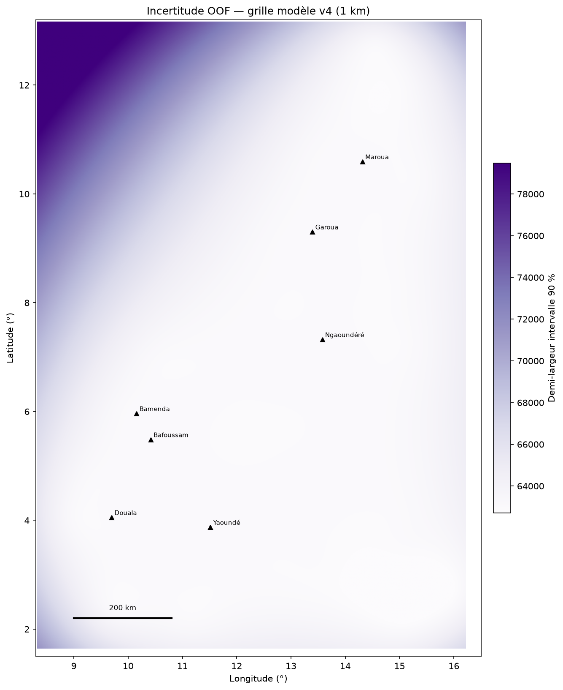
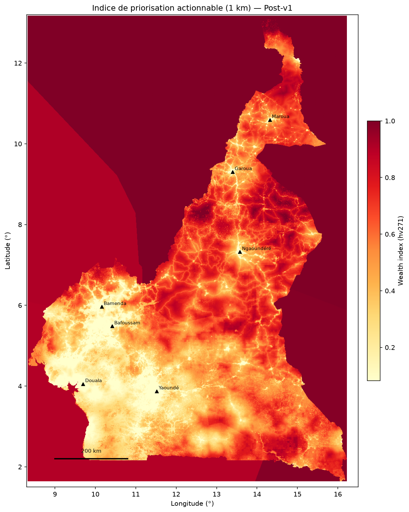
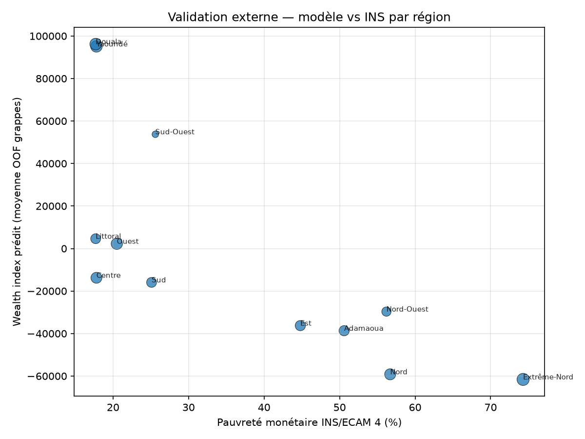

# Cameroon Poverty Mapping

**Cartographie de la pauvreté au Cameroun à haute résolution (~1 km)**  
Combinaison de données DHS 2018, Google Earth Engine et validation avec les statistiques officielles de l’INS.


## 🎯 Pourquoi ce projet ?

À 20 ans, en partant de données limitées et de ressources modestes au Cameroun, ce projet vise à produire une **cartographie fine et actionnable** de la pauvreté pour aider les chercheurs, les ONG et les décideurs à mieux cibler les interventions.

## ✨ Résultats Principaux (v1.1.0)

- **430 grappes DHS 2018** réelles traitées
- **Feature Set v4** avec variables contextuelles INS
- **Performance du modèle** :
  - R² OOF : **0.793**
  - Spearman : **0.889**
- Cartes nationales avec **incertitude** et **zones d’actionnabilité**
- Validation externe avec données officielles INS (cohérence régionale forte)

## 📊 Visualisations & Cartes

Cartes nationales à **1 km** (modèle v4/v5_post, DHS 2018 + GEE + INS). Usage exploratoire — croiser toujours l’incertitude.

### Carte nationale — indice de richesse estimé

Proxy DHS au niveau pixel ; les zones sombres correspondent aux estimations de bien-être plus faible.


### Carte d’incertitude du modèle

Variabilité des prédictions (ensemble CV spatial). Les zones à incertitude élevée demandent une validation locale avant toute lecture fine.



### Carte d’actionnabilité — priorisation exploratoire

Indice composite pauvreté estimée + accessibilité (écoles, santé, routes OSM). **Non opérationnel** — aide à prioriser des zones pour dialogue partenaire, pas pour allocation budgétaire.



### Validation externe — modèle vs INS (ECAM 4)

Concordance régionale entre prédictions OOF et taux de pauvreté monétaire INS ; Spearman ≈ **−0.87** (12 régions).



## 🚀 Comment Reproduire

```bash
git clone https://github.com/adamouabakar/cameroon-poverty-mapping.git
cd cameroon-poverty-mapping

pip install -r requirements.txt

# Pipeline complet
python scripts/run_pipeline.py