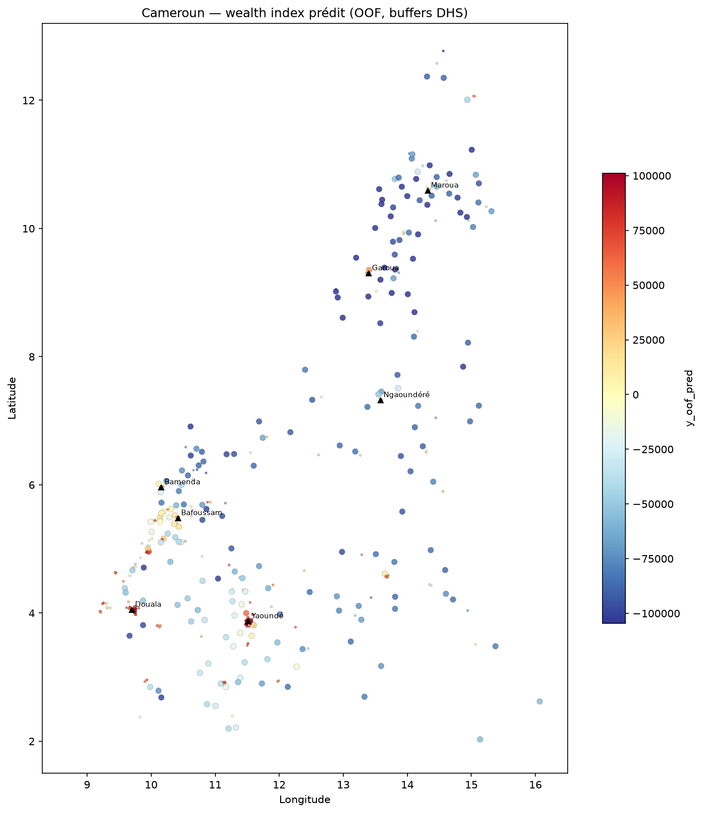

# Cartographie de la pauvreté au Cameroun

[](LICENSE)
[](https://www.python.org/)
[](https://dhsprogram.com/)
[](https://earthengine.google.com/)

**Pipeline open-source et reproductible** pour estimer l'indice de richesse DHS à **~1 km** au Cameroun, à partir de données ouvertes (DHS 2018, imagerie satellite, OSM, WorldPop) et d'un modèle **LightGBM** validé spatialement.

> *English summary:* Open pipeline combining DHS 2018 cluster wealth index, Google Earth Engine geospatial features (v3: GHSL + CHIRPS), and spatial cross-validation to produce national poverty maps at ~1 km resolution.

---

## Résultats (données réelles DHS 2018)

| Indicateur | Valeur |
|------------|--------|
| Grappes DHS | **430** |
| Feature set | **v3** (13 variables : GHSL + CHIRPS + base) |
| CV spatiale | Block (5 folds) |
| **R² OOF** | **0.776** |
| **Spearman OOF** | **0.875** |
| RMSE OOF | 39 939 (échelle hv271 brute) |

### Features les plus importantes

1. `night_lights_mean` — urbanisation / activité économique  
2. `precip_annual_mm` — climat (CHIRPS)  
3. `pop_density` — densité humaine  
4. `dist_road_km` — accessibilité  
5. `ghsl_built_fraction` — surface bâtie (corrélation r ≈ 0.74 avec wealth)

### Cartes produites

| Carte | Fichier |
|-------|---------|
| National (grappes) | `outputs/maps/wealth_national_clusters.png` |
| National (raster 1 km) | `outputs/maps/wealth_index_predicted_1km.tif` |
| Incertitude | `outputs/maps/wealth_uncertainty_1km.tif` |
| Régionales | `outputs/maps/regional/*.png` |



*Carte OOF sur buffers DHS — voir [limitations](documentation/limitations.md) avant usage opérationnel.*

---

## Démarrage rapide

### Prérequis

- Python ≥ 3.10
- Compte [Google Earth Engine](https://earthengine.google.com/) (recherche)
- Données DHS Cameroun 2018 ([demande d'accès](https://dhsprogram.com/)) → placer dans `data/raw/dhs/`

### Installation

```bash
git clone https://github.com/adamouabakar/cameroon-poverty-mapping.git
cd cameroon-poverty-mapping

python -m venv .venv
# Windows
.\.venv\Scripts\activate
# Linux/macOS
source .venv/bin/activate

pip install -r requirements.txt
earthengine authenticate
```

Configurer `gee.project_id` dans `configs/gee.yaml`.

### Pipeline complet (une commande)

```bash
python scripts/run_pipeline.py
# ou : make pipeline
make test   # 50 tests (données fictives isolées)
```

Étapes individuelles ou partielles :

```bash
python scripts/run_pipeline.py --only dhs      # Préparer grappes DHS
python scripts/run_pipeline.py --only gee      # Extraire features GEE v3
python scripts/run_pipeline.py --only model    # Entraîner + évaluer
python scripts/run_pipeline.py --only maps     # Régénérer cartes
python scripts/regenerate_maps.py              # Alias cartes uniquement
```

Si les parquets sont déjà générés :

```bash
python scripts/run_pipeline.py --skip-dhs --skip-gee
```

---

## Structure du projet

```
cameroon-poverty-mapping/
├── configs/              # default.yaml, gee.yaml, prioritization
├── data/
│   ├── raw/dhs/          # Fichiers DHS (non versionnés — accès restreint)
│   └── processed/        # Parquets générés (non versionnés)
├── documentation/        # Méthodologie, limites, reproductibilité
├── models/               # Modèles LightGBM entraînés (.pkl)
├── notebooks/            # Pipelines interactifs
├── outputs/
│   ├── maps/             # Cartes PNG + GeoTIFF
│   └── reports/          # Métriques, QA, synthèse
├── scripts/              # Pipeline automatisé
└── src/                  # Code source (data, features/gee, models, viz)
```

---

## Notebooks

| Notebook | Description |
|----------|-------------|
| `02_modeling_real_data_executed.ipynb` | Modélisation LightGBM sur 430 grappes réelles (résultats) |
| `03_gee_feature_extraction.ipynb` | Extraction features GEE v3 |
| `03_results_visualization.ipynb` | Visualisations et cartes nationales |

---

## Feature sets GEE

| Version | Contenu | Colonnes |
|---------|---------|----------|
| v1 | WorldCover (bâti) | 10 |
| v2 | GHSL (bâti) | 10 |
| **v3** | GHSL + CHIRPS (précipitations) | **13** |

Détail : [`documentation/gee_features.md`](documentation/gee_features.md)

---

## Documentation

| Document | Contenu |
|----------|---------|
| [`REPRODUCIBILITY.md`](REPRODUCIBILITY.md) | Guide de reproduction pas à pas |
| [`documentation/methodology.md`](documentation/methodology.md) | Méthodologie complète |
| [`documentation/limitations.md`](documentation/limitations.md) | Limites, éthique, usage |
| [`documentation/final_results_summary.md`](documentation/final_results_summary.md) | Synthèse des résultats |
| [`PROJECT_STATUS.md`](PROJECT_STATUS.md) | Bilan et feuille de route |

---

## Avertissement

Les cartes sont des **estimations exploratoires** calibrées sur l'indice de richesse DHS au niveau des grappes. Elles :

- ne remplacent **pas** les statistiques officielles de l'INS ;
- ne doivent **pas** servir au ciblage direct de ménages ou villages ;
- héritent du **jitter GPS** DHS (2 km urbain / 5 km rural).

Lire [`documentation/limitations.md`](documentation/limitations.md) avant toute utilisation.

---

## Références

- Jean, N., et al. (2016). *Science*, 353(6301), 790–794.
- Yeh, C., et al. (2020). *Nature Communications*, 11, 2583.
- ICF (2019). *Cameroon Demographic and Health Survey 2018*.

---

## Licence et citation

- **Licence :** [MIT](LICENSE)
- **Citation :** voir [`CITATION.cff`](CITATION.cff)

---

## Contribuer

Les contributions (issues, PR, documentation en français/anglais) sont les bienvenues. Voir [`PROJECT_STATUS.md`](PROJECT_STATUS.md) pour les prochaines étapes.